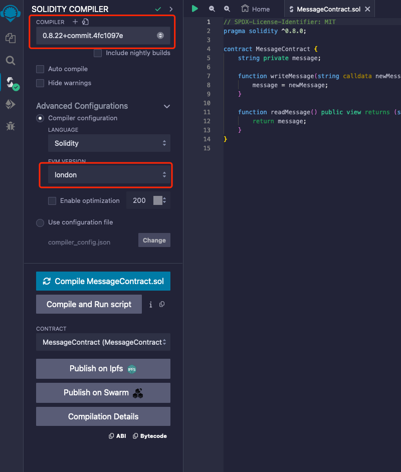
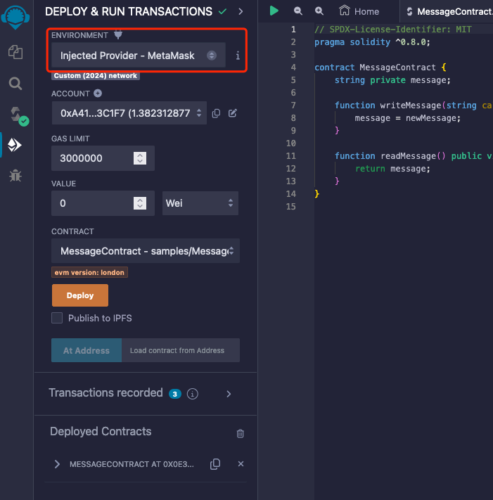

1.Open Remix IDE: Navigate to [Remix IDE](https://remix.ethereum.org/) and create a new file called `SimpleStorage.sol`.
2. Click the "Advanced Configurations" tab and select the Solidity version `london`.

3. on Deploy & Run Transactions, select `Injected Provider- metamask` as the environment, and Click the deploy button to deploy the contract.
